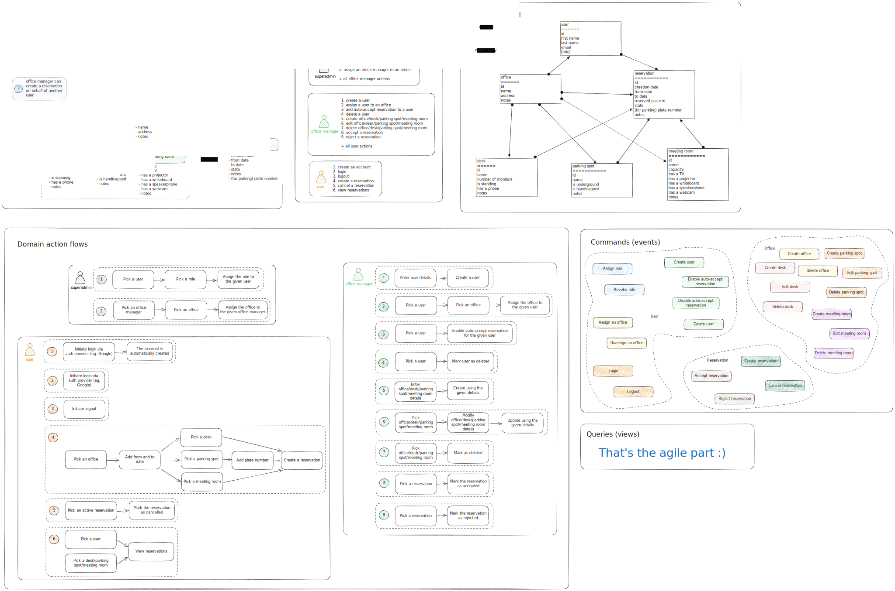
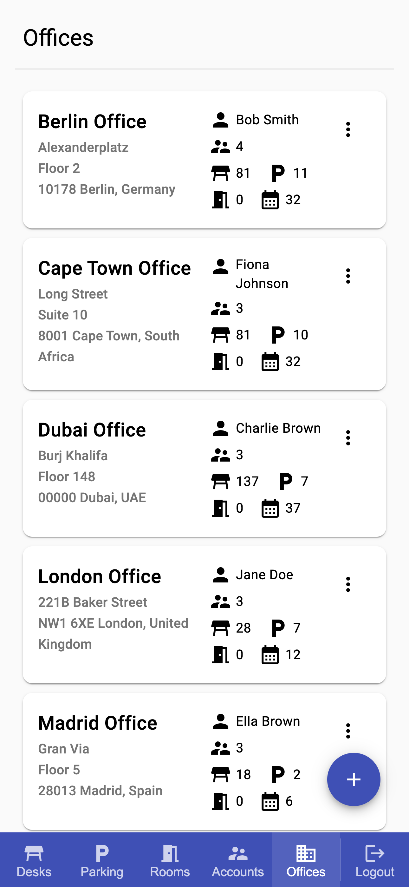
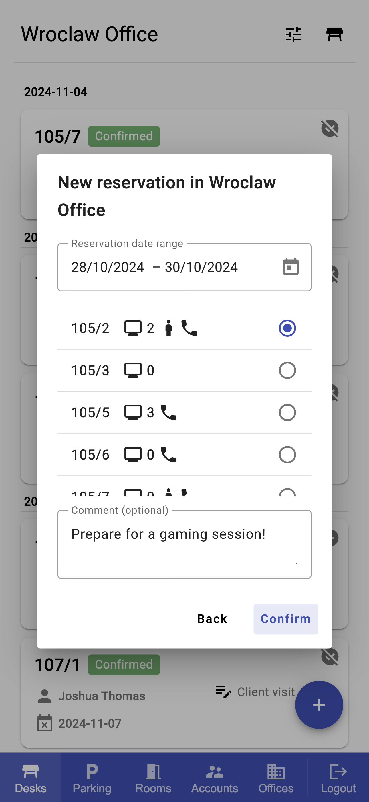
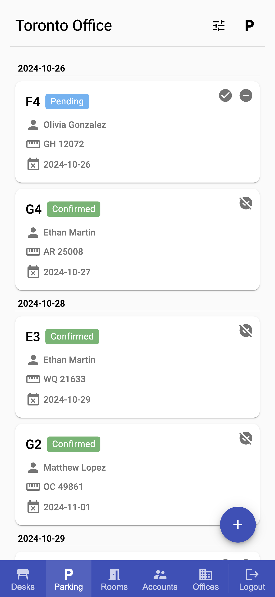
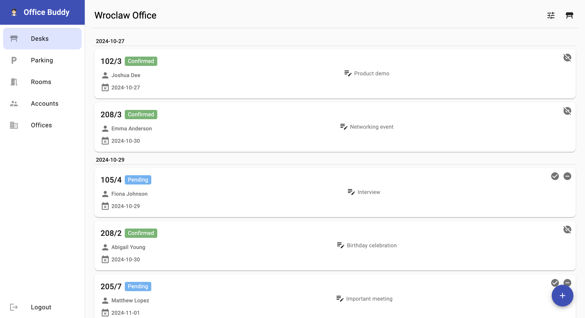
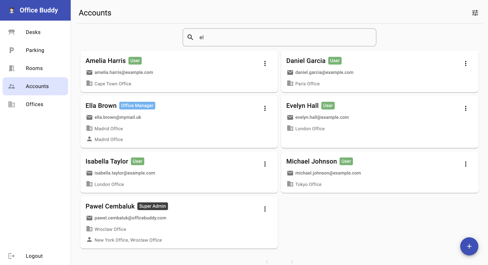
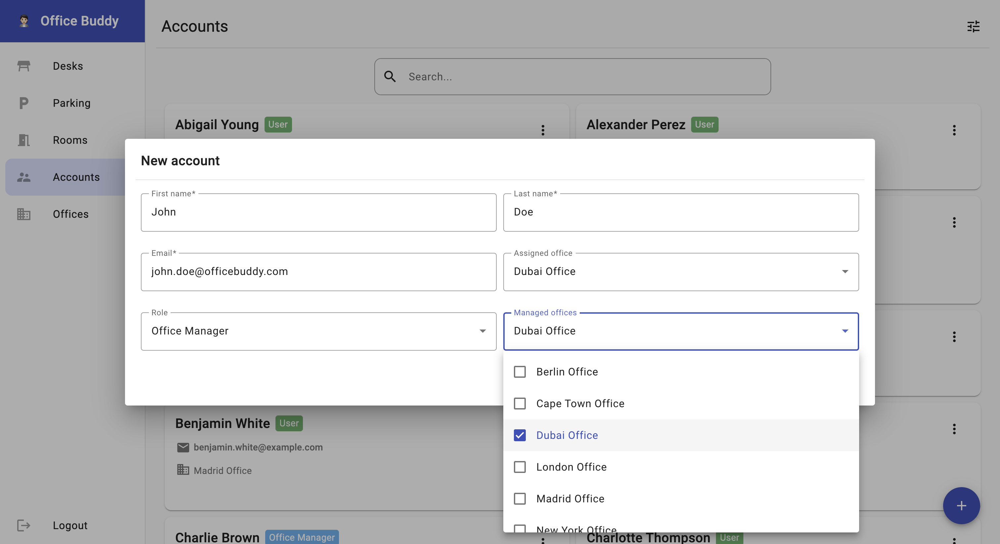

# OfficeBuddy

OfficeBuddy is a simple office management application. It's my pet project to expand my knowledge about some new areas
and reinforce the knowledge of the ones I already know.

Things you'll find in this project:

- small-scale DDD approach
- purely functional backend written in Scala with [Cats Effect](https://typelevel.org/cats-effect/)
- tests written using [Weaver](https://disneystreaming.github.io/weaver-test/)
  and [Mockito Scala](https://github.com/mockito/mockito-scala)
- mobile-first frontend written in Angular using mostly GitHub Copilot (it turns out it's quite good!)
- ...and probably more to come in the future if I continue the development :smile:

Improvements yet to be made are marked with TODOs in the code and listed in the issues.

## Domain landscape

> :information_source: You might open the in a separate tab or in [Excalidraw](https://excalidraw.com/) to see the
> details.



## Screenshots

|  |  |  |
|:------------------------------------------:|:-------------------------------------------------------:|:-------------------------------------------------------:|

|  |
|:---------------------------------------------:|
|           |
|        |

## Running the app

The below setup assumes the default config set up in the repository files.

### Running on local machine

To run the infrastructure, use the following command:

```shell
docker-compose -f docker/infra.yaml up -d --wait
```

This will run Postgres database, Keycloak and Mailpit containers. To run the backend, use:

```shell
sbt run
```

And to run the frontend:

```shell
cd ui
ng serve
```

The frontend app will be available at http://localhost:4200.

When the app is first run, it creates a superadmin account with the following credentials:

- username: `superadmin@officebuddy.com`
- password: `superadmin`

It then can be used to configure the app. The app loads some demo data by default, including accounts. Other accounts
are available when you use "Forgot password" in the login form. Provide the email address of the account you want to
use, and the password reset link will be available in Mailpit at http://localhost:8025.

#### API documentation

The API documentation can be found at http://localhost:8080/docs endpoint by default.

To obtain bearer token for existing account to use the API, use the following curl command:

```shell
OB_KEYCLOAK_URL='http://localhost:8888'
OB_USERNAME='<username>'
OB_PASSWORD='<password>'
curl -s -L -X POST "$OB_KEYCLOAK_URL/realms/office-buddy/protocol/openid-connect/token" \
-H "Content-Type: application/x-www-form-urlencoded" \
--data-urlencode "client_id=office-buddy-ui" \
--data-urlencode "grant_type=password" \
--data-urlencode "username=$OB_USERNAME" \
--data-urlencode "password=$OB_PASSWORD" | jq -r '.access_token'
```

#### Teardown

To close the app, first cancel the frontend and backend processes. Then, use the following command to remove the
infrastructure:

```shell
docker-compose -f docker/infra.yaml down
```

### Running in containers only

To run the app in containers only, use the following:

```shell
# Build the backend image
sbt Docker/publishLocal

# Build the frontend image
docker build -t officebuddy-ui:latest \
  --build-arg KEYCLOAK_URL=http://localhost:8888 \
  --build-arg KEYCLOAK_REALM=office-buddy \
  --build-arg KEYCLOAK_CLIENT_ID=office-buddy-ui \
  --build-arg BACKEND_PROXY_URL=http://backend:8080 ./ui

# Run the app  
docker-compose -f docker/office-buddy/docker-compose.yaml --env-file docker/.env up -d
```

The addresses of the app are the same as described in [Running on local machine](#running-on-local-machine) section.

#### Teardown

To close the app, use the following command:

```shell
docker-compose -f docker/office-buddy/docker-compose.yaml down
```